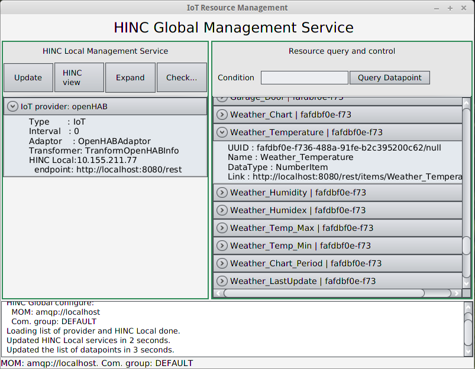

In order to test HINC, we need a couple of providers and and message oriented middleware. This tutorial will show how to setup OpenHAB as provider and using HINC to capture information. We choose OpenHAB because of its easy installation and lightweight.

The configuration in this example aim to run everything on a single machine, e.g. user's laptop. For distributed deployment, please edit the settings accordingly.

{:width="700px"}


**1. Run OpenHAB demo**

1.1. On the [OpenHAB website](http://www.openhab.org/getting-started/downloads.html), download the **Runtime core** and the **Demo setup**.

1.2. Extract both package to the same folder. Note that the Demo setup package will be merged into the Runtime core after extracting.

1.3. Open a shell in the extracted folder and run: `$ ./start.sh`.

1.4. Run a simple query to make sure OpenHAB is running: `$ curl http://localhost:8080/rest/items`

**2. Prepare a AMQP service**

2.1. Option 1: Install a local RabbitMQ. In Ubuntu, this can be done by the command: `$ sudo apt-get install -y rabbitmq-server`

2.2. Option 2: Create a free plan of [CloudAMQP](https://www.cloudamqp.com/)

**3. Run HINC Local**

3.1. Grab the `local-management-service-1.0.jar` and `TransformOpenHAB-1.0.jar` (follow the [Installation guideline](../doc/installation.html))

3.2. Create a `hinc.conf` for HINC related settings as followings:

```sh
# if using local RabbitMQ
BROKER=amqp://localhost 
# if using CloudAMQP, username and password is attached in URL (put your own URL in your CloudAMQP account)
# BROKER=amqp://<username>:<password>@bunny.cloudamqp.com/abc
BROKER_TYPE=amqp
# Multiple HINC Local service can be group to a communication channel.
GROUP=test
```

3.3. Copy the **source.conf.default** into a new file name **source.conf**. This file contains all the configuration required for the adaptors.

With OpenHAB running locally, uncomment and change the following line in the file:

```sh
openhab.endpoint=http://localhost:8080/rest
```

3.4. Copy above 4 files (2 .jar and 2 .conf files) to a same folder. Then run the command:

```sh
$ java -cp "local-management-service-1.0.jar:TransformOpenHAB-1.0.jar" sinc.hinc.local.Main
```

The HINC Local should run, start to contact to OpenHAB to get the information, and subscribe to the AMQP broker to listen to the control. 

**4. Using HINC Global to query information**

4.1. Copy the artifact `global-management-service-1.0-war-exec.jar` in to a new folder and add the `hinc.conf` file similar 3.2.

The same `hinc.conf`, ensure HINC Global and HINC Local can communicate.

4.2. Run HINC Global by following command. Note that we use different port because OpenHAB is taking the port 8080 on the same machine.

```sh
$ java -jar global-management-service-1.0-war-exec.jar -httpPort 8888
```

4.3. Open the HINC Global via browser `http://localhost:8888/global-management-service-1.0`, we can have the list of APIs as bellow:

{:width="500px"}

Some metadata can be retrieve by query the `meta` API:

```sh
$ curl http://localhost:8888/global-management-service-1.0/rest/meta
```

**5. Using HINC Client GUI to view some data**

5.1. Get the artifact of the client-gui and run. The client by default will check HINC Global at http://localhost:8888 for testing purpose.

```sh
java -jar client-gui-1.0.jar
```

5.2. The GUI will show the list of providers on the left and the list of data points on the right. See figure below.

{:width="600px"}

